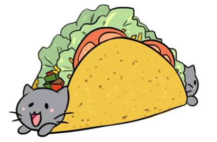
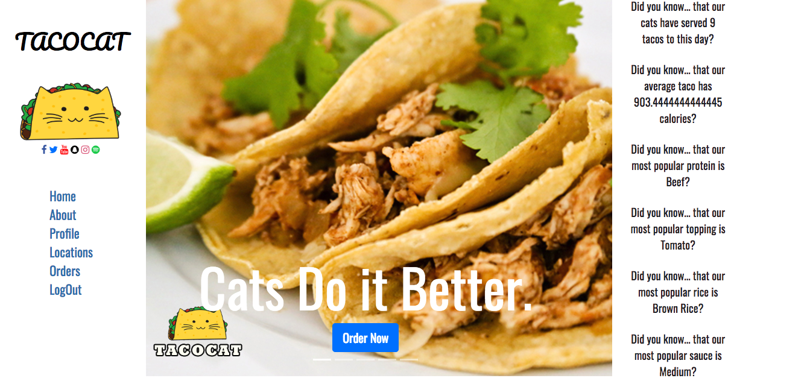
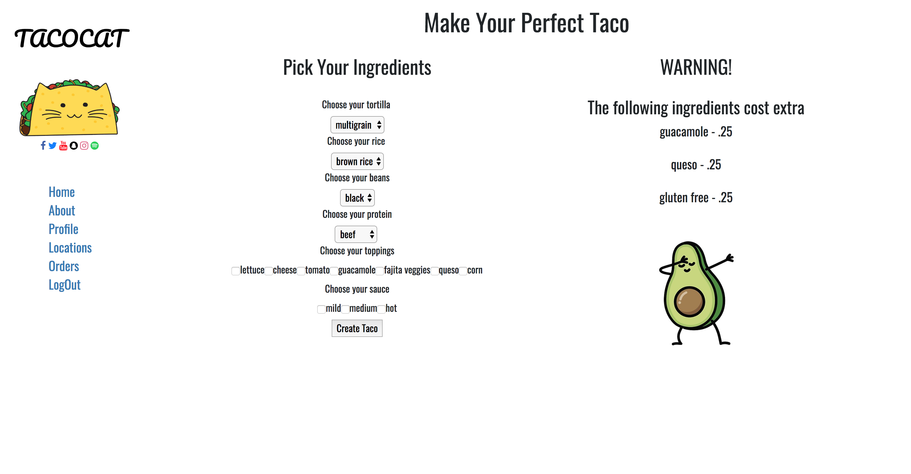
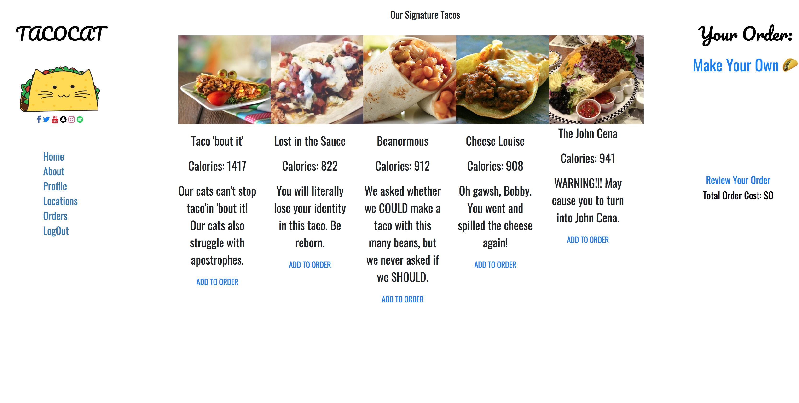

# TACOCAT

A taco ordering web app that is organized by cats, who knew cats could be so innovative?

Watch a demo video here:

## Our App allows you to create an account that keeps track of your orders.

### You can order one of our signature dishes..

## ..or choose to make one yourself!

Coded in Ruby using Ruby on Rails, this app has full CRUD functionality and follows RESTful routing conventions.
It also has proper session management and communicates with a SQL database through a Rails back end.
